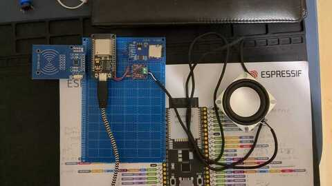

# phoniesp32 🎶🔋

A **kid-friendly jukebox** powered by the **ESP32**, inspired by
[Phoniebox](https://phoniebox.de). Unlike the original Raspberry Pi–based
version, **phoniesp32** is designed to be **battery-operated, low-power, and
ultra-portable**.

> ⚠️ Work in Progress — Contributions, ideas, and wiring tips are very welcome!

---

## 📥 Download Latest Firmware

[Download Firmware](https://github.com/butzist/phoniesp32/actions) (download the
`firmware` artifact from the latest run on main)

## ✨ Features

- **ESP32-based jukebox**: replaces the Raspberry Pi with an ESP-WROOM-32, or
  newer.
- **Low-power & battery-ready**: runs on a Li-ion cell with TP4056 charging and
  MT3608 boost converter.
- **Bare-metal Rust firmware**: built on the [`embassy`](https://embassy.dev/)
  async embedded framework.
- **Rust-powered Web UI**: implemented with [Dioxus](https://dioxuslabs.com/)
  and served directly from the ESP32.
- **Audio transcoding & upload**: convert music files via the web frontend to
  IMA ADPCM, upload to device, and play back instantly.
- **RFID support**: scan S50 fobs with the FRC522 module to trigger playlists.
- **Affordable**: target build cost **under 15 CHF**.

---

## 🛠 Components

- **MCU**: ESP-WROOM-32
- **Charging/Power**: TP4056 (Li-ion charger), MT3608 (boost converter)
- **Battery**: Li-ion cell (e.g. 18650)
- **Audio**: MAX98357 (I2S DAC + amplifier)
- **Storage**: SD card adapter
- **RFID**: FRC522 module + S50 RFID fobs

---

## 🚧 Project Status

 Current
work-in-progress prototype with lots of noisy data lines...

- [ ] Hardware
  - [x] Prototype on breadboard
  - [x] Soldered Prototype
  - [ ] Battery charger
  - [ ] Schematics
  - [ ] Custom PCB
  - [ ] Design and 3D print case
- [ ] UI (Dioxus)
  - [x] File transcoding
  - [x] Served from device
  - [x] Show last scanned RFID tag ID
  - [x] Switch to Bluma CSS
  - [x] Playback control
  - [x] Store RIFF INFO chunk for artist/title
  - [x] Associate file with RFID tag
  - [x] Configure Wi-Fi settings
  - [ ] Playlists
  - [x] List known tags
  - [x] List uploaded files
  - [ ] Speed up transcoding
  - [x] Update to stable Dioxus 0.7
- [ ] Firmware (Embassy)
  - [x] Fallback to Wi-Fi AP mode
  - [x] Audio pipeline (I2S → MAX98357)
  - [x] SD card access
  - [x] Playback control via buttons
  - [x] Playback control via RFID tags
  - [ ] Pause playback
  - [ ] Turn off Wi-Fi when on battery power
  - [x] Playlists
  - [ ] mDNS responder
  - [x] Use RIFF INFO chunk for artist/title
  - [ ] Power management
  - [ ] Speed up SD access/upload
  - [ ] SD card partitioning support
  - [ ] Async / IRQ for RFID reader
  - [ ] Playback control via BLE
  - [ ] Update to stable esp-hal 1.0
- [ ] Web API (picoserve)
  - [x] Associate file with RFID tag
  - [x] Playback control
  - [ ] Playback status
  - [x] Last scanned RFID tag ID
  - [x] Configure Wi-Fi settings
  - [x] List known tags
  - [x] List uploaded files
  - [x] Playlists
- [x] Build system
  - [x] Build and bundle all components
  - [x] Build via GitHub actions
- [ ] Documentation
  - [ ] Full build instructions
  - [ ] Video tutorial

---

## 🤝 Contributing

Want to help build the cheapest, most fun, and hackable jukebox for kids?

- Review my code! I bet there are many possibilities to optimize power/memory
  usage
- Create schematics & PCB in KiCad
- Implement any of the missing features
- Share your ideas

PRs, issues, and ideas are always welcome!

---

## 📜 License

MIT License — free to use, hack, and share.
