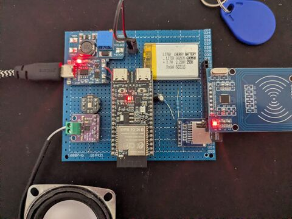
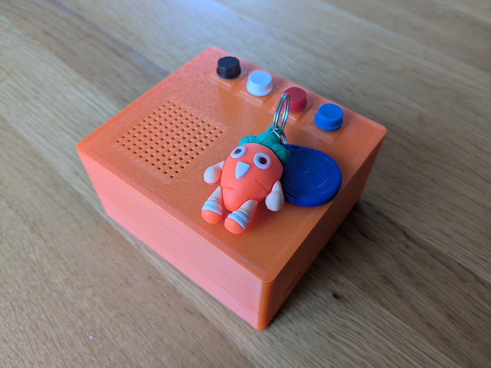

# phoniesp32 🎶🔋

A **kid-friendly jukebox** powered by the **ESP32**, inspired by
[Phoniebox](https://phoniebox.de). Unlike the original Raspberry Pi–based
version, **phoniesp32** is designed to be **battery-operated, low-power, and
ultra-portable**.

> ⚠️ Work in Progress — Contributions, ideas, and wiring tips are very welcome!

---

## 📥 Download Latest Firmware

[Download Firmware](https://github.com/butzist/phoniesp32/actions) (download the
`firmware` artifact from the latest run on main)

## ✨ Features

- **ESP32-based jukebox**: replaces the Raspberry Pi with an ESP32-C6.
- **Low-power & battery-ready**: runs on a Li-ion cell with TP4056 charging and
  MT3608 boost converter.
- **Bare-metal Rust firmware**: built on the [`embassy`](https://embassy.dev/)
  async embedded framework.
- **Rust-powered Web UI**: implemented with [Dioxus](https://dioxuslabs.com/)
  and served directly from the ESP32.
- **Audio transcoding & upload**: convert music files via the web frontend to
  IMA ADPCM, upload to device, and play back instantly.
- **RFID support**: scan S50 fobs with a MFRC522 module to trigger playlists.
- **Affordable**: target build cost **under 50 CHF**.

---

## 🛠 Components

- **MCU**: ESP32-C6
- **Charging/Power**: BQ24073 (Li-ion charger), TSP631000 (buck-boost converter)
- **Battery**: Li-ion cell (e.g. 18650)
- **Audio**: MAX98357 (I2S DAC + amplifier)
- **Storage**: SD card adapter
- **RFID**: MFRC522 module + S50 RFID fobs

---

## 🏗 Build Options

1. **[DIY Breakout Board Build](./docs/diy-build.md)** - Build using
   off-the-shelf breakout boards on a breadboard or prototype board (~25 CHF)

---

## 🚧 Project Status

- [ ] Hardware
  - [x] Prototype on breadboard
  - [x] Soldered Prototype
  - [x] Battery charger
  - [x] Schematics
  - [x] Custom PCB
  - [ ] Design and 3D print case
- [x] UI (Dioxus)
  - [x] File transcoding
  - [x] Served from device
  - [x] Show last scanned RFID tag ID
  - [x] Switch to Bluma CSS
  - [x] Playback control
  - [x] Store RIFF INFO chunk for artist/title
  - [x] Associate file with RFID tag
  - [x] Configure Wi-Fi settings
  - [x] Playlists
  - [x] List known tags
  - [x] List uploaded files
  - [x] Continue file upload
  - [x] Styling
  - [x] Do not use CDN
  - [x] Update to stable Dioxus 0.7
- [ ] Firmware (Embassy)
  - [x] Fallback to Wi-Fi AP mode
  - [x] Audio pipeline (I2S → MAX98357)
  - [x] SD card access
  - [x] Playback control via buttons
  - [x] Playback control via RFID tags
  - [x] Pause playback
  - [x] Playlists
  - [x] Use RIFF INFO chunk for artist/title
  - [x] Fix concurrent access to file system
  - [x] mDNS responder
  - [x] Turn off Wi-Fi when on battery power
  - [x] Captive portal and DHCP server for WiFi access point
  - [x] Speed up SD access/upload (SD card was bad - turns out cheap SD cards
        are bad at SPI)
  - [ ] Playback control via BLE
  - [x] SD card partitioning support
  - [x] Update to stable esp-hal 1.0
- [x] Web API (picoserve)
  - [x] Associate file with RFID tag
  - [x] Playback control
  - [x] Playback status
  - [x] Last scanned RFID tag ID
  - [x] Configure Wi-Fi settings
  - [x] List known tags
  - [x] List uploaded files
  - [x] Playlists
- [ ] Command line utility
  - [x] Transcode
  - [ ] Upload
  - [ ] Playback control
  - [ ] Associate
- [x] Build system
  - [x] Build and bundle all components
  - [x] Build via GitHub actions
- [ ] Upstream fixes
  - [ ] `dioxus`: Support sass:color.channel()
  - [x] `mfrc522`: async / IRQ support implemented in
        [mfrc522-async](https://github.com/butzist/mfrc522-async)
- [ ] Documentation
  - [x] [API Documentation](./API.md)
  - [x] [DIY Build Instructions](./docs/diy-build.md)
  - [ ] Video tutorial

---

## 🤝 Contributing

Want to help build the cheapest, most fun, and hackable jukebox for kids?

- Review my code! I bet there are many possibilities to optimize power/memory
  usage
- Create schematics & PCB in KiCad
- Implement any of the missing features
- Share your ideas

PRs, issues, and ideas are always welcome!

---

## 📜 License

MIT License — free to use, hack, and share.
