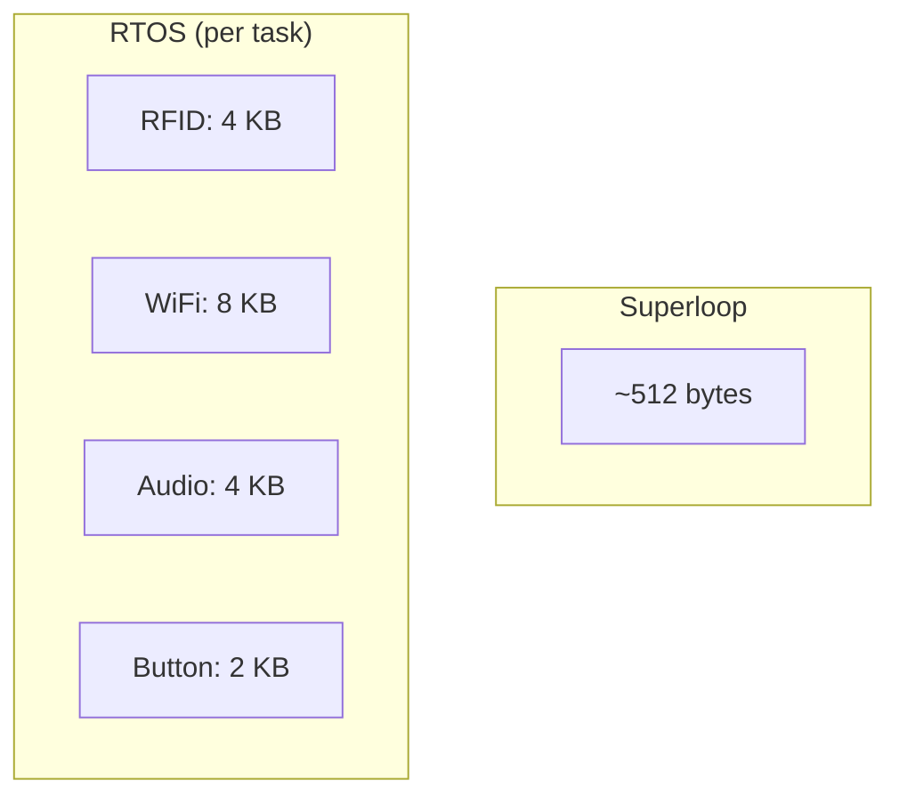
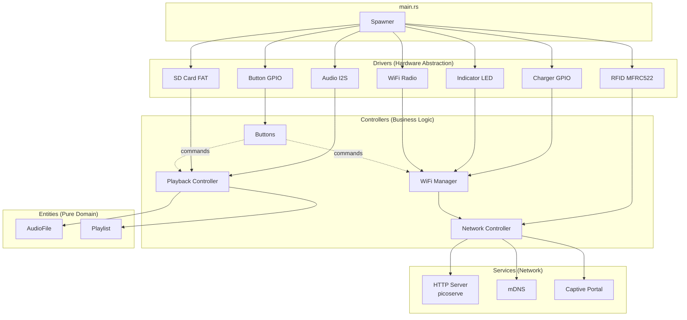
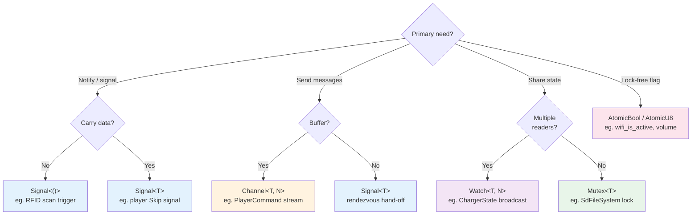
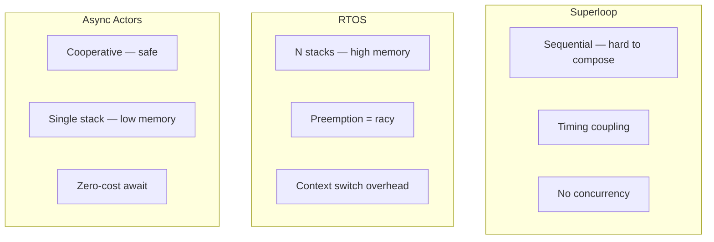

# How to Use Async Actors on Bare Metal

Embedded development has a well-worn path: the superloop. You initialize
everything, then `while(1)` with a sequence of polling calls. It works for
blinking LEDs, but as soon as you need concurrent I/O (WiFi, SD card, RFID,
audio playback, button debouncing), things get gnarly.

```c
void loop() {
    check_buttons();      // blocking, 5ms
    poll_rfid();          // blocking, 100ms
    update_wifi();        // blocking, could be seconds
    led_blink();          // non-blocking, but timing drifts
    delay(10);            // waste
}
```

Enter the RTOS. FreeRTOS gives you real threads with preemptive scheduling. Each
"thing" gets its own stack, its own `while(1)`. Problem solved, right?

```c
void rfid_task(void *pv) {
    while(1) {
        poll_rfid();
        vTaskDelay(100 / portTICK_PERIOD_MS);
    }
}
void wifi_task(void *pv) { /* ... */ }
void audio_task(void *pv) { /* ... */ }
```



But that cost adds up. Each RTOS task reserves a full stack — worst-case
allocation. On the ESP32 with 512 KB RAM, four tasks at 4-8 KB each is
noticeable. Worse: you're back to shared mutable state with mutexes, and if you
want composable state machines, you're hand-rolling them.

## The Actor Model

Languages like Erlang and Rust (with Tokio/Embassy) offer a different approach:
**actors**. Each actor is an independent async task that owns its state and
communicates via message passing, not shared memory. Erlang's OTP formalizes
this into supervisors, gen_servers, and the "let it crash" philosophy.

The trick? Async runtimes use cooperative multitasking with **a single stack per
executor**, not per task. Each task's state lives in a small Future struct —
often a few hundred bytes.

## Our Architecture: Four Layers



**Drivers** wrap raw hardware with an async task and return a `Handle`.
**Controllers** receive Handles from drivers, implement state machines, and
orchestrate higher-level operations (like "play this playlist"). **Services**
are network-facing tasks that use a network `Stack` from the WiFi controller.
**Entities** are pure domain objects with no I/O.

## How Embassy Makes This Possible

[Embassy](https://embassy.dev) is an async executor for bare-metal embedded
Rust. It gives you the same `async/await` you'd use on the server, but with
`no_std`, no allocator required, and full interrupt integration. On the ESP32 it
runs on top of ESP-IDF's FreeRTOS (via `esp_rtos`), but the executor is
Embassy's — meaning zero-cost task switching.

```rust
// One stack for the executor. Hundreds of "tasks" multiplexed on it.
#[esp_rtos::main]
async fn main(spawner: Spawner) {
    // Init hardware
    let player = Player::new(i2s, dma, bclk, ws, dout, enable);
    let charger = Charger::new(charger_pin, level);
    let rfid = Rfid::new(spi, cs, irq, enable_pin).await;

    // Spawn driver tasks → get Handles
    let player_handle = PlaybackController::new(player, fs).spawn(&spawner);
    let charger_monitor = charger.spawn(&spawner);
    let rfid_handle = rfid.spawn(&spawner);

    // Spawn controllers with driver handles
    let wifi_handle = WifiManager::new().spawn(&spawner, radio_handle, ...);
    Buttons::new(btn_a, btn_b, btn_c, btn_d).spawn(&spawner, wifi_handle, player_handle);

    // Main loop stays minimal
    loop {
        rfid_handle.trigger_scan();
        match rfid_handle.wait_for_scan_result().await {
            RfidScanResult::Found(fob) => player_handle.play_playlist_ref(fob).await,
            _ => Timer::after(Duration::from_millis(500)).await,
        }
    }
}
```

The `#[embassy_executor::task]` macro turns each `async fn` into a state machine
stored in a static. Switching between tasks is just resuming a Future — no
context switch, no kernel trap, no cache invalidation.

## The Spawn/Handle Pattern

Every component in our system follows one pattern:

```rust
pub struct MyDriver { /* hardware fields */ }

impl MyDriver {
    pub fn new(pins...) -> Self { /* ... */ }

    pub fn spawn(self, spawner: &Spawner) -> MyHandle {
        // 1. Allocate sync primitives in static memory
        let channel = mk_static!(Channel<NoopRawMutex, Cmd, 4>, Channel::new());
        // 2. Spawn the task
        spawner.must_spawn(my_task(self.hardware, channel));
        // 3. Return a cloneable handle
        MyHandle { tx: channel.sender() }
    }
}

/// Cloneable, Send-safe API for external consumers
#[derive(Clone)]
pub struct MyHandle {
    tx: &'static Channel<NoopRawMutex, Cmd, 4>,
}

impl MyHandle {
    pub async fn do_thing(&self) {
        self.tx.send(Cmd::DoThing).await;
    }
}

#[embassy_executor::task]
async fn my_task(hw: Hardware, channel: &'static Channel<NoopRawMutex, Cmd, 4>) {
    loop {
        let cmd = channel.receive().await;
        match cmd {
            Cmd::DoThing => hw.do_thing().await,
        }
    }
}
```

This encapsulates the task completely. The consumer never touches hardware,
never holds a raw pointer, never worries about lifetime safety. The handle is
the **only** API. This makes testing trivial — you can mock the handle in tests
(or better, write integration tests against a real handle with a mocked hardware
backend).

## Choosing the Right Sync Primitive

The hardest part of async actor design is figuring out **which message-passing
primitive to use**. Here's our cheat sheet:



When the decision is driven by lifetime patterns rather than producer count,
reach for higher-level primitives:

| Primitive                                 | When to use                                                                                                                                                                                                 |
| ----------------------------------------- | ----------------------------------------------------------------------------------------------------------------------------------------------------------------------------------------------------------- |
| **Signal** (no buffer, rendezvous)        | Wake a task. One-shot notification with or without a payload. Example: `skip_signal` fires `Skip::Next`/`Skip::Prev` into the playback task.                                                                |
| **Channel** (buffered queue)              | Commands and data streams. The playback controller sends `PlayerCommand::Stop` into a `Channel<..., 2>`. The audio decoder produces `AudioPacket::Buffer` into a `Channel<..., 1>` for the I2S output task. |
| **Watch** (broadcast, retains last value) | Observable state. The charger GPIO task `sender.send(Connected)` and three consumers read via `receiver.changed()`. New subscribers always get the latest value immediately.                                |
| **Mutex** (async, `no_std`)               | Exclusive access to a shared resource. The SD card filesystem is guarded by `Mutex<SdFileSystem>` — only one task reads/writes at a time.                                                                   |
| **Atomic**                                | Lock-free flags. `AtomicBool` for "is WiFi active?" (polled from the main loop). `AtomicU8` for volume (read by the decoder task, written by the controller task).                                          |

## Built to be Testable

Because every actor communicates through a typed `Handle`, testing is
straightforward:

- **Unit-test entities** — pure functions on `AudioFile`, `Playlist`, etc.
- **Test a controller** — give it a mock Handle that records commands instead of
  talking to hardware.
- **Integration-test drivers** — run the real task against a loopback handle.

No hardware stubs, no global state teardown, no linker script hacks. The handle
is the seam.

## Why This Beats Both Superloop and RTOS



|                                 | Classic Arduino            | RTOS (FreeRTOS)            | Async Actors (Embassy)                    |
| ------------------------------- | -------------------------- | -------------------------- | ----------------------------------------- |
| **Memory per task**             | Single stack (~512 B)      | Full stack (2-8 KB)        | Future state (bytes to hundreds of bytes) |
| **Concurrency model**           | Sequential, polling        | Preemptive threads         | Cooperative async                         |
| **Inter-task communication**    | Global variables           | Queues + mutexes           | Typed channels, signals, watchers         |
| **State machine composability** | Hand-rolled enums + switch | Hand-rolled enums + switch | `select3`, `join`, `with_timeout`         |
| **Testing**                     | Hardware-in-loop           | Hardware-in-loop           | Handle mocking, async test harness        |
| **Sleep/power save**            | Manual, error-prone        | Manual, error-prone        | `select` + timeout → natural light sleep  |

## The Stack

ESP32, Embassy (async executor), `esp_hal` (peripherals), picoserve (HTTP),
heapless (static containers), static_cell (static allocation). Fully `no_std`,
nightly Rust.

The full source is available at
[github.com/butzist/phoniesp32](https://github.com/anomalyco/phoniesp32) — a
WiFi audio player for kids that uses RFID fobs to trigger playlist playback.
Every driver, controller, and service follows the spawn/handle pattern described
here.
